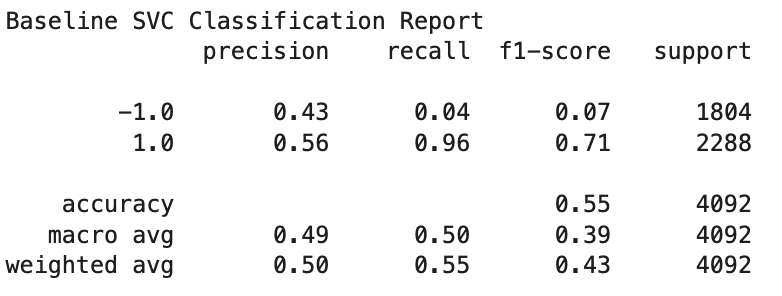
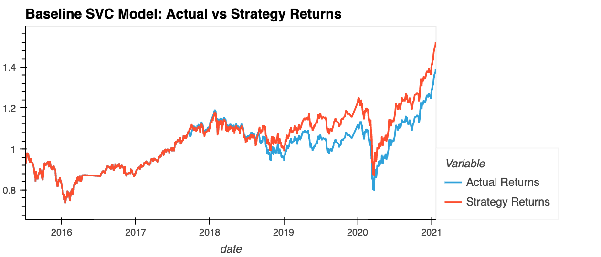
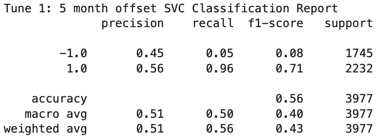
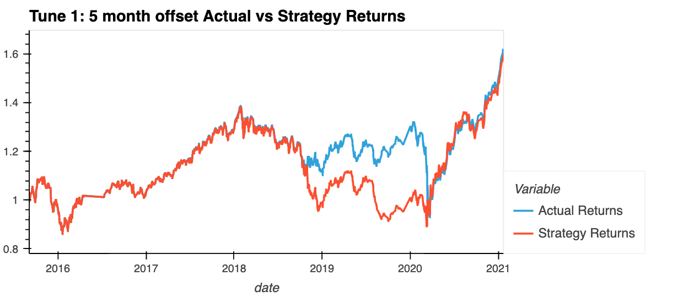
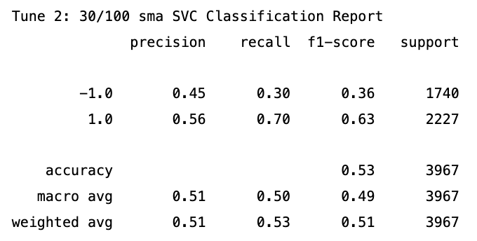
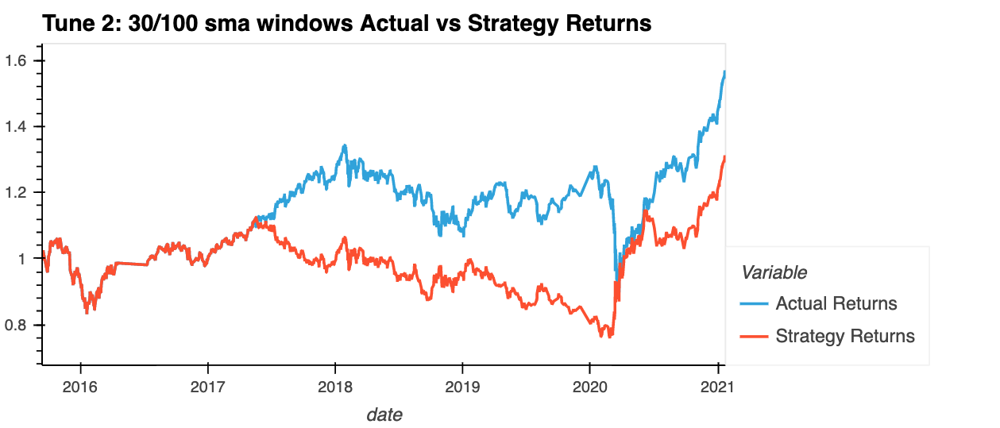
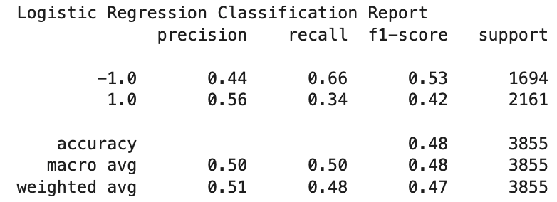
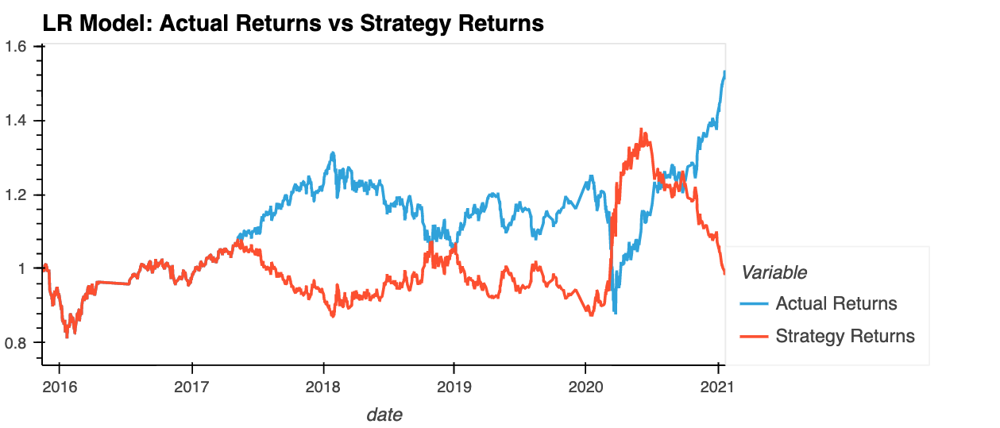

# Module_14_Challenge

Creating a Machine Learning Trading Bot: 
The goal of of this project is to enhance existing trading signals with machine learning algorithms that can adapt to new data.

## Technologies

_We used the following libraries in our notebook:_
* Pandas

* NumPy

* hvPlot

* Matplotlib

* scikit-learn

---

## Usage

The data used to create the models and evualtions is located in the 'Resources' folder of this repository.

---

# Evalutation Report

## Baseline SVM 

* ##  This is the model we used as a baseline to compare and evaluate changes we made to try to improve accuracy. 

 

___

# _First Tune:_

What impact resulted from increasing or decreasing the training window? 
* You can see that buy incerasing the trainging window we increased the accruracy of the model.

---

# _Second Tune:_

 What impact resulted from increasing or decreasing either or both of the SMA windows?
 * The accuracy of the model went down when the short window SMA was increased to 30 days from 4 days
  

# Using a new classifier: LogisticRegression

Did this new model perform better or worse than the provided baseline model? 
* This model performed worse than the baseline model. 

Did this new model perform better or worse than your tuned trading algorithm?
* This model also performed worse than the tuned trading algorithm. 
___
## Summary: 
* ### The first tune we performed, increasing the training window on the SVM model, gave us the highest accuracy. 

---

## Contributors

G. Cale McDowell

[@gcm107](https://github.com/gcm107)

---

## License